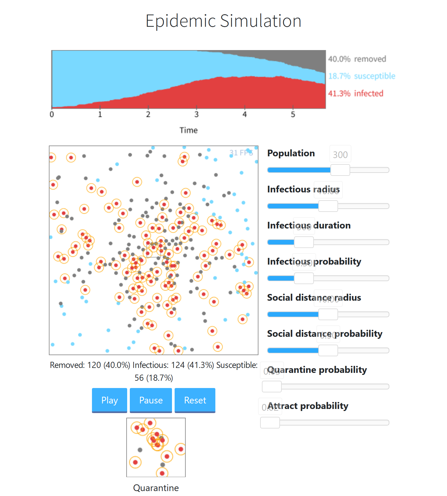

# Epidemic Simulator
## Abstract
Playable simulation of a virus outbreak.  
Note that the result doesn't prove anything quantitatively.  
Please keep in mind that this simulation is only limited to a simplified model.

## Concepts
This simulation aims to show how the virus spreads, and how we can cope with it.
As indicated above, we don't argue about the small details of the outcome.  

In this simulation, people are categorized into three states: Susceptible, Infectious, Removed.  
The Susceptible people are not yet infected, the Infectious are people who have been infected, and the Removed are deceased or recovered ones.

Each individual is represented as a point, walking randomly.
At the start, only a few people are already infected, the others are all in the Susceptible status. As the simulation evolves, the virus starts to spread by many close contacts with the infected and susceptible, finally resulting in an outbreak.

Additionally, to see the effect of virus prevention methods, the following parameters are introduced.
* Social Distancing
* Quarantine / Isolation

Plus you can see how "densely populated spot" would effect the outbreak speed by tweaking the parameter.

## Overview Snapshot

## Reference
* The Washington Post  
[" Why outbreaks like coronavirus spread exponentially, and how to “flatten the curve” "  ](https://www.washingtonpost.com/graphics/2020/world/corona-simulator/)

## Dependencies
* Typescript (ES2017)
* Babel (ES2017 -> E5)
* Bootstrap (v4.5)
* [noUiSlider.js](https://github.com/leongersen/noUiSlider)

## License
MIT License
